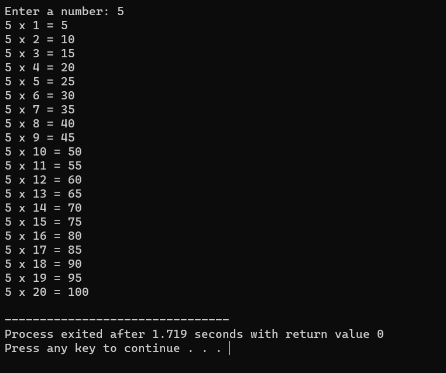

# loops

1] [Table Printer](table_printer.cpp)
This C++ program takes a user-inputted number and generates the multiplication table for that number, displaying the result of multiplying the number by integers from 1 to 20. It uses a do-while loop to calculate and print the results, making it a straightforward educational example for learning loops and basic input/output in C++.

  

 
