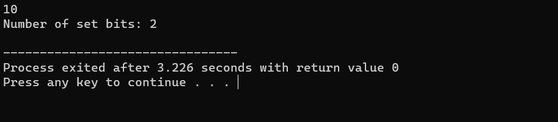
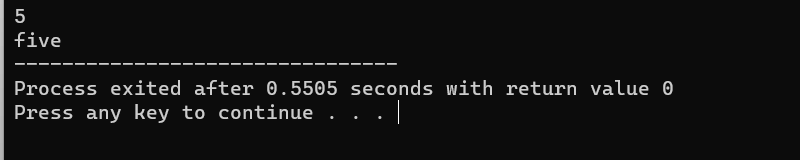

# loops

1] [Table Printer](table_printer.cpp)
This C++ program takes a user-inputted number and generates the multiplication table for that number, displaying the result of multiplying the number by integers from 1 to 20. It uses a do-while loop to calculate and print the results, making it a straightforward educational example for learning loops and basic input/output in C++.

  

 

2] [Digit calculations](set.cpp)
This C++ program takes an integer as input and calculates the number of set bits (1s) in its binary representation. It uses bitwise operations to count the set bits and displays the count. This code serves as an example of working with bitwise operations in C++.

  

 

3]  [ number to text](numtotext.cpp)

  

 
